# 에이전트 조직도

```mermaid
graph TB
    대표["대 표<br/>(사용자)"]

    대표 --> 총괄["총 괄<br/>(OMC Orchestrator)"]
    대표 --- 참모실["경영참모실"]

    참모실 --> 분석관["분석관<br/>(analyst)"]
    참모실 --> 기획관["기획관<br/>(planner)"]
    참모실 --> 설계관["설계관<br/>(architect)"]
    참모실 --> 비평관["비평관<br/>(critic)"]
    참모실 --> 형상관리["형상관리<br/>(git-master)"]

    총괄 --> 개발["개발본부"]
    총괄 --> 플랫폼["플랫폼본부"]
    총괄 --> 품질["품질본부"]
    총괄 --> 제품["제품본부"]
    총괄 --> 데이터["데이터/AI본부"]

    %% ── 개발본부 ──
    개발 --> 실행자["실행자 (executor)"]
    개발 --> 심층실행["심층실행 (deep-executor)"]
    개발 --> 디버거["디버거 (debugger)"]
    개발 --> 탐색자["탐색자 (explore)"]
    개발 --> TS전문["TS 전문 (typescript-pro)"]
    개발 --> 리액트["리액트 전문 (react-specialist)"]
    개발 --> 풀스택["풀스택 (fullstack-developer)"]
    개발 --> 일렉트론["일렉트론 (electron-pro)"]

    %% ── 플랫폼본부 ──
    플랫폼 --> 빌드수리["빌드 수리 (build-fixer)"]
    플랫폼 --> 의존성["의존성 전문 (dependency-expert)"]
    플랫폼 --> 배포["배포 엔지니어 (deployment-engineer)"]
    플랫폼 --> MCP개발["MCP 개발 (mcp-developer)"]
    플랫폼 --> 운영["운영 엔지니어 (devops-engineer)"]
    플랫폼 --> 슬랙["슬랙 전문 (slack-expert)"]
    플랫폼 --> API설계["API 설계 (api-designer)"]

    %% ── 품질본부 ──
    품질 --> 코드리뷰["코드 리뷰 (code-reviewer)"]
    품질 --> 보안리뷰["보안 리뷰 (security-reviewer)"]
    품질 --> 품질리뷰["품질 리뷰 (quality-reviewer)"]
    품질 --> 성능리뷰["성능 리뷰 (performance-reviewer)"]
    품질 --> 테스트설계["테스트 설계 (test-engineer)"]
    품질 --> 검증자["검증자 (verifier)"]
    품질 --> 보안공학["보안 공학 (security-engineer)"]
    품질 --> 성능공학["성능 공학 (performance-engineer)"]
    품질 --> 테스트자동["테스트 자동화 (test-automator)"]

    %% ── 제품본부 ──
    제품 --> 디자이너["디자이너 (designer)"]
    제품 --> PM["제품관리자 (product-manager)"]
    제품 --> UX연구["UX 연구 (ux-researcher)"]
    제품 --> 정보설계["정보설계 (information-architect)"]
    제품 --> UI디자인["UI 디자인 (ui-designer)"]
    제품 --> SEO["SEO 전문 (seo-specialist)"]

    %% ── 데이터/AI본부 ──
    데이터 --> 연구원["연구원 (scientist)"]
    데이터 --> 작성자["문서작성 (writer)"]
    데이터 --> AI공학["AI 공학 (ai-engineer)"]
    데이터 --> 분석가["데이터 분석 (data-analyst)"]
    데이터 --> 프롬프트["프롬프트 공학 (prompt-engineer)"]

    %% ── 스타일 ──
    classDef top fill:#4a5568,stroke:#2d3748,color:#fff,font-weight:bold
    classDef mid fill:#5a6a8a,stroke:#4a5568,color:#fff,font-weight:bold
    classDef staff fill:#6b7fa0,stroke:#4a5568,color:#fff
    classDef div fill:#718096,stroke:#4a5568,color:#fff,font-weight:bold
    classDef omc fill:#a0aec0,stroke:#718096,color:#1a202c
    classDef custom fill:#e2e8f0,stroke:#a0aec0,color:#1a202c

    class 대표 top
    class 총괄 mid
    class 참모실 staff
    class 분석관,기획관,설계관,비평관,형상관리 staff
    class 개발,플랫폼,품질,제품,데이터 div
    class 실행자,심층실행,디버거,탐색자,빌드수리,의존성,코드리뷰,보안리뷰,품질리뷰,성능리뷰,테스트설계,검증자,디자이너,PM,UX연구,정보설계,연구원,작성자 omc
    class TS전문,리액트,풀스택,일렉트론,배포,MCP개발,운영,슬랙,API설계,보안공학,성능공학,테스트자동,UI디자인,SEO,AI공학,분석가,프롬프트 custom
```

## 조직 현황

| 부서 | 인원 | 구성 |
|------|------|------|
| 경영참모실 | 5 | 분석·기획·설계·비평·형상관리 |
| 개발본부 | 8 | 기본 4 + 전문 4 |
| 플랫폼본부 | 7 | 기본 2 + 인프라 3 + 통합 2 |
| 품질본부 | 9 | 기본 6 + 전문 3 |
| 제품본부 | 6 | 기본 4 + 전문 2 |
| 데이터/AI본부 | 5 | 기본 2 + 전문 3 |
| **합계** | **40** | **기본 18 + 전문 17 + 참모 5** |

## 범례

- **진한 회색** = 기본 제공 에이전트 (OMC 빌트인)
- **연한 회색** = 커스텀 도메인 전문가 (`~/.claude/agents/` 폴더)
- 괄호 안 영문 = 실제 호출명
